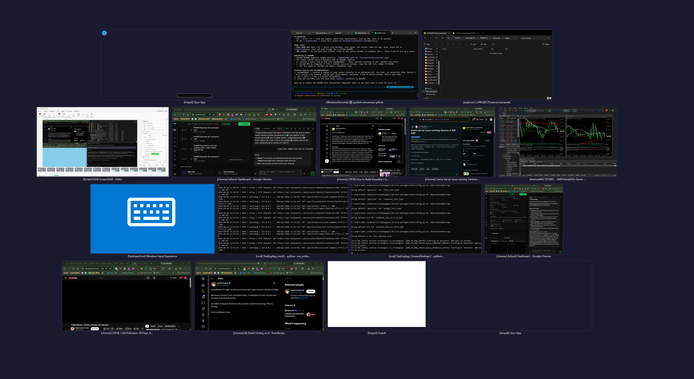
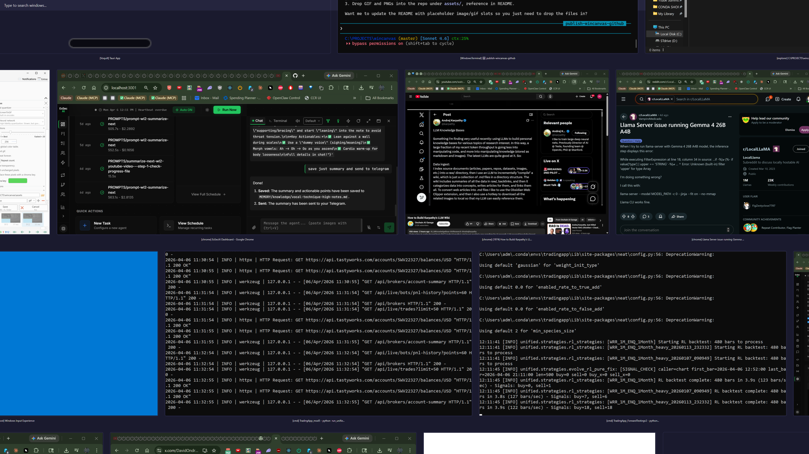

# WinCanvas

Infinite canvas window manager for Windows. Shows live DWM thumbnails of all open windows on a pannable, zoomable canvas -- including windows on other virtual desktops.


WinCanvas is a lightweight **window switcher and virtual desktop manager** for Windows 10/11 that gives you a live bird's-eye view of every open window -- across all virtual desktops -- on a single zoomable canvas. Think of it as an Expose/Mission Control experience for Windows: hit Ctrl+Space from any app, see everything at once, click to jump. Unlike traditional alt-tab replacements or taskbar tools (PowerToys, AltSnap, TaskSwitchXP), WinCanvas renders real-time DWM thumbnails on an infinite canvas you can pan and zoom freely, with instant search and cross-desktop navigation -- no window moves, no layout presets, no configuration.





## Requirements

- Windows 10 / 11 with DWM enabled (default)
- Rust toolchain

## Build

```
cargo build --release
```

Binary: `target\release\wincanvas.exe`

## Controls

| Action | Input |
|---|---|
| Toggle canvas | Ctrl+Space (global hotkey) |
| Pan | Right-click drag |
| Zoom | Scroll wheel |
| Switch to window | Left-click thumbnail |
| Search | Type to filter by title |
| Clear search / hide | Escape |
| Pin / focus window | F1 |
| Exit pin mode | Escape or F1 |

## Architecture

```
src/
  main.rs       Win32 message loop, hotkeys, VDM desktop switching, pin mode
  canvas.rs     Pan/zoom/inertia, grid layout, hit testing
  thumbnails.rs Window enumeration (EnumWindows), DWM thumbnail lifecycle
  render.rs     Direct2D / DirectWrite rendering
  search.rs     Case-insensitive title filtering
```

Uses the DWM Thumbnail API for live hardware-accelerated previews, Direct2D for chrome, and IVirtualDesktopManager for cross-desktop window navigation.
